# Muqdisho Market Prices - System Design Documentation

Dukumentigan wuxuu faahfaahinayaa qaabdhismeedka nidaamka (System Design), qaabka xogtu u socoto (Data Flow Diagrams), naqshadda database-ka (Database Design), iyo qaabdhismeedka guud ee nidaamka (System Architecture Diagram) ee codsiga **Muqdisho Market Prices**.

Dhammaan jaantusyada (diagrams) waxaa loo qaabeeyay inay leeyihiin **background cad** iyo **far/khad madow** si ay u sahlanaato akhriskoodu iyo daabacaadoodu.

---

## ● 4.6 System Design

Nidaamka kormeerka qiimaha suuqyada Muqdisho (Mogadishu Market Prices System) waxaa loo qaabeeyay inuu u adeego dadweynaha iyo maamulayaasha suuqyada. Qaybtani waxay sharraxaysaa habdhaqanka iyo qaabdhismeedka nidaamka iyadoo la adeegsanayo jaantusyo kala duwan.

### 4.6.1 Use Case Diagram (Jaantuska Isticmaalka)
Jaantuskan wuxuu muujinayaa sida jilayaasha kala duwan (Public User, Category Admin, iyo Super Admin) ay ula falgalaan qaybaha kala duwan ee nidaamka.

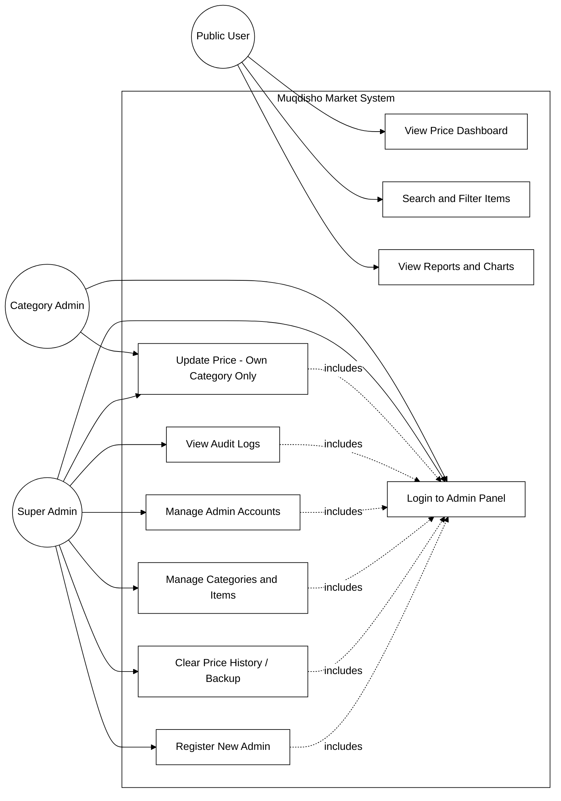

#### Rendered Use Case Diagram:
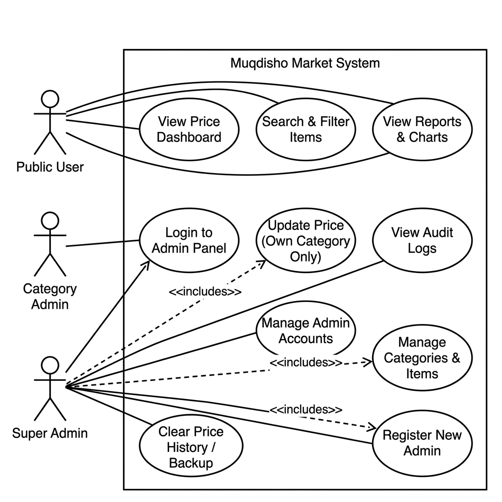

---

### 4.6.2 Data Flow Diagrams (DFD - Socodka Xogta)

#### DFD Level 0 (Context Diagram)
Jaantuskan wuxuu muujinayaa nidaamka guud oo xiran (Black Box) iyo sida uu xogta ula wadaago jilayaasha dibadda ah.

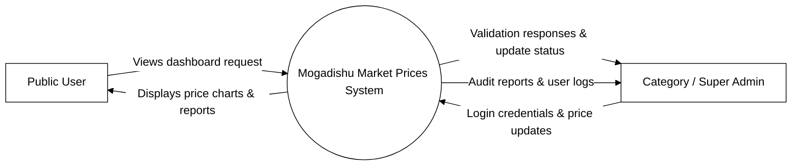

#### DFD Level 1 (Process Diagram)
Jaantuskan wuxuu u kala jebinayaa nidaamka dhowr habraac oo waaweyn si loo arko meelaha xogtu ka dhex baxdo iyo halka lagu kaydiyo (Database-ka).

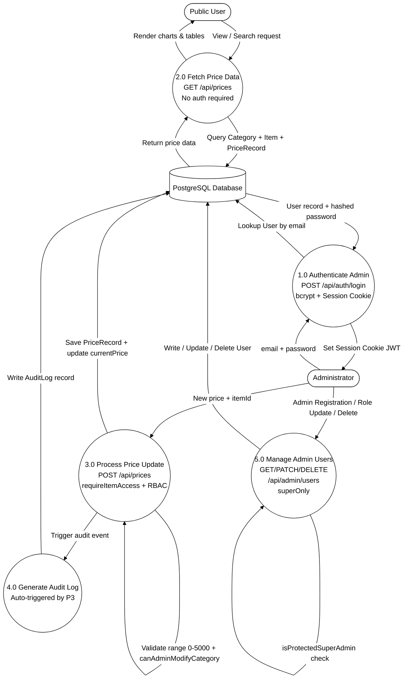

#### Rendered Data Flow Diagram (DFD):
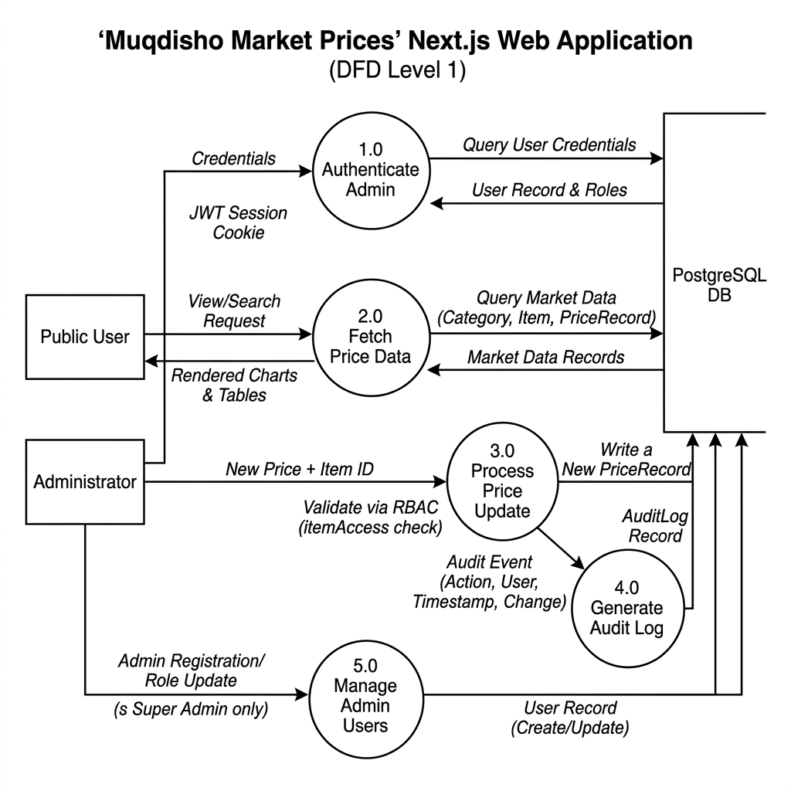

---

### 4.6.3 UML Class Diagram (Jaantuska Heerka Fasalka)
Jaantuskaan wuxuu muujinayaa fasalada (Classes), astaamahooda (Attributes), iyo hababka ay u wada shaqeeyaan (Methods & Relationships).

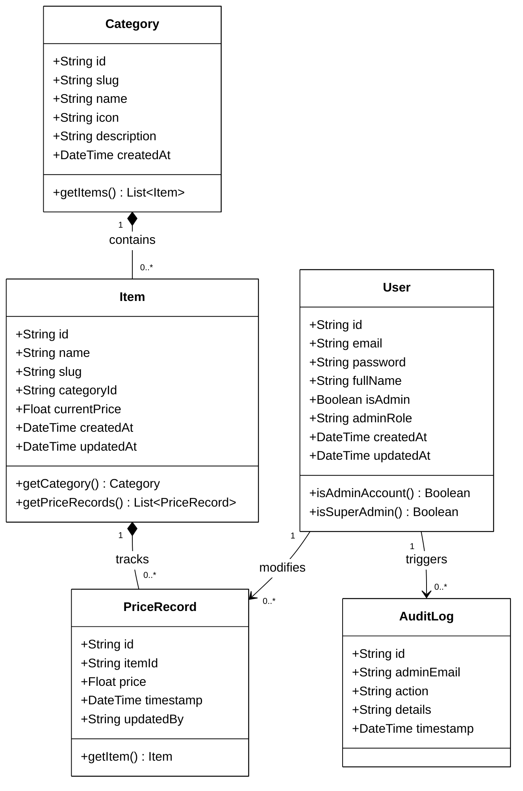

#### Rendered UML Class Diagram:
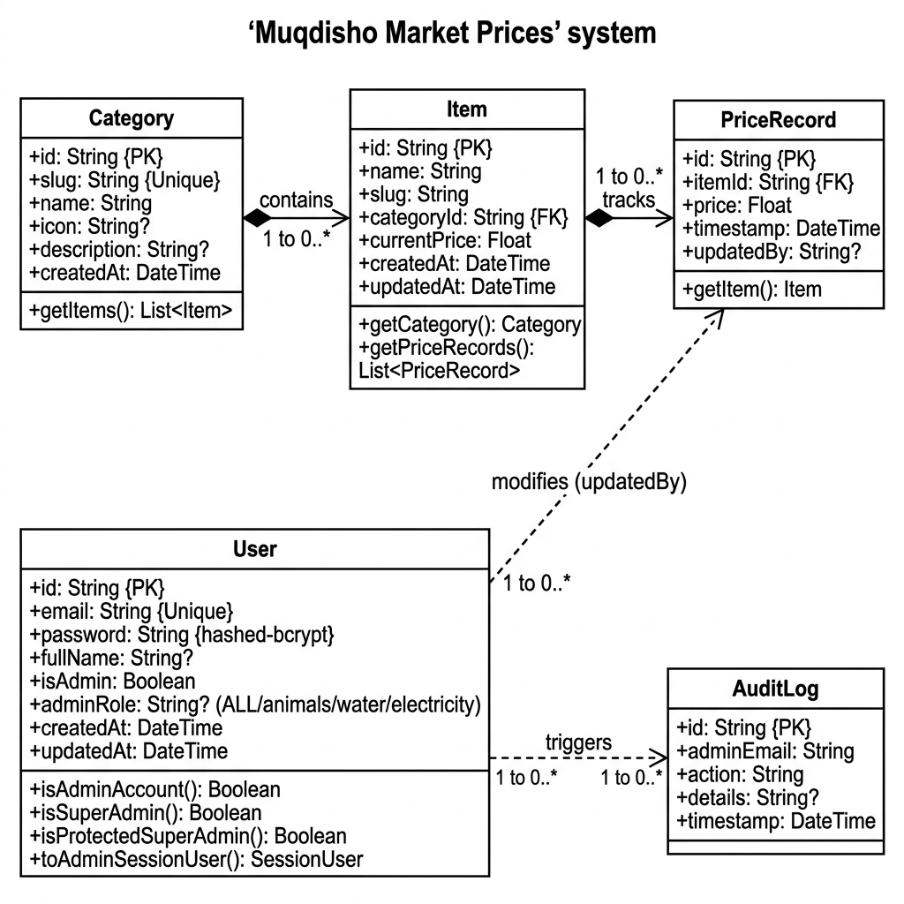

---

### 4.6.4 Entity-Relationship (ER) Diagram (Xiriirka Kaydka Xogta)
ER Diagram wuxuu sharraxayaa sida shaxda kala duwan ee database-ka ay isugu xiran yihiin, furayaasha asaasiga ah (Primary Keys - PK), iyo kuwa martida ah (Foreign Keys - FK).

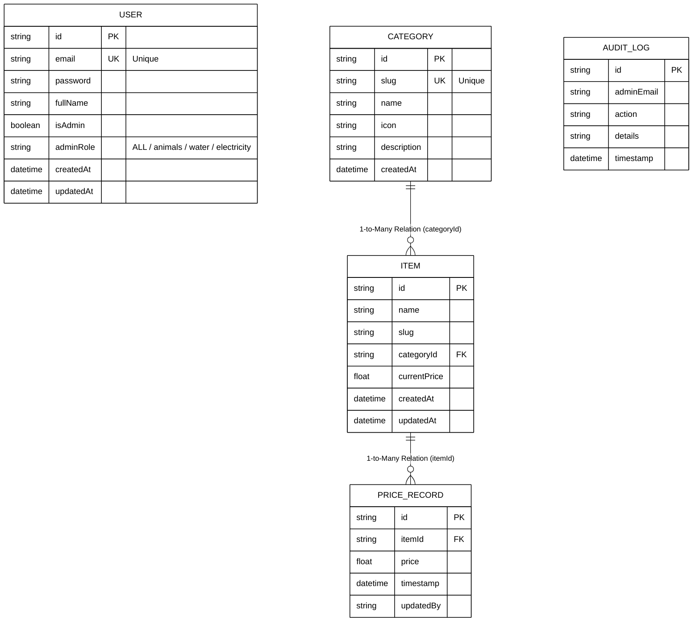

#### Rendered Entity-Relationship Diagram (ERD):
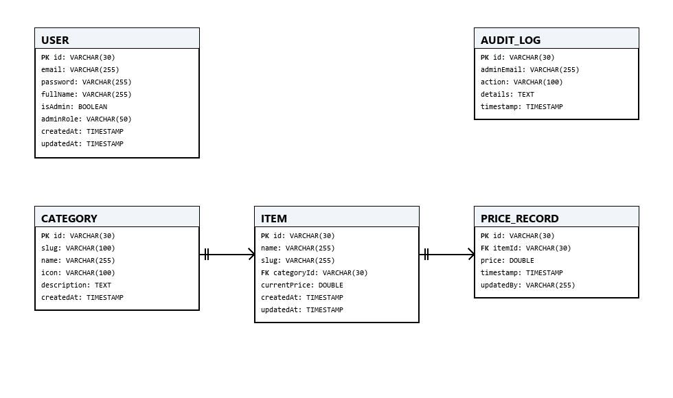

---

## ● 4.7 Database Design (Naqshadda Database-ka)

Nidaamka wuxuu adeegsadaa kaydka xogta ee **PostgreSQL** iyadoo la marayo **Prisma ORM**. Dhammaan aqoonsiyada (IDs) waxay isticmaalaan habka `cuid()` ee dhalinta ID-yo caalami ah oo gaar ah (globally unique).

#### 1. Shaxda Isticmaalaha (`User` Table)
Waxay kaydisaa maamulayaasha iyo xuquuqaha ay leeyihiin.
*   **Primary Key:** `id` (VARCHAR)
*   **Unique Index:** `email` (Si looga hortago laba akoon oo isku email ah)

| Magaca Goobta (Field) | Nooca Xogta (Data Type) | Nullable | Xayiraad / Default | Sharraxaad |
| :--- | :--- | :--- | :--- | :--- |
| `id` | VARCHAR(30) | Maya | PK, `default(cuid())` | Aqoonsiga gaarka ah ee isticmaalaha. |
| `email` | VARCHAR(255) | Maya | Unique | Email-ka loginka loo isticmaalo. |
| `password` | VARCHAR(255) | Maya | None | Password-ka oo loo kaydiyay hab qarsoodi ah (hashed). |
| `fullName` | VARCHAR(255) | Haa | None | Magaca buuxa ee isticmaalaha (waa ikhtiyaari). |
| `isAdmin` | BOOLEAN | Maya | `default(false)` | Calaamad muujinaysa inuu maamule yahay. |
| `adminRole` | VARCHAR(50) | Haa | `default("ALL")` | Role-ka: `ALL` (Super Admin), `animals`, `water`, `electricity`. |
| `createdAt` | TIMESTAMP | Maya | `default(now())` | Waqtiga akoonka la abuuray. |
| `updatedAt` | TIMESTAMP | Maya | Auto-updating | Waqtiga ugu dambeeyay ee wax laga beddelay. |

#### 2. Shaxda Qaybaha (`Category` Table)
Waxay kaydisaa qaybaha waaweyn ee qiimaha la kormeero (tusaale: Xoolaha, Biyaha, Korontada).
*   **Primary Key:** `id` (VARCHAR)
*   **Unique Index:** `slug` (URL-friendly string)

| Magaca Goobta (Field) | Nooca Xogta (Data Type) | Nullable | Xayiraad / Default | Sharraxaad |
| :--- | :--- | :--- | :--- | :--- |
| `id` | VARCHAR(30) | Maya | PK, `default(cuid())` | Aqoonsiga qaybta. |
| `slug` | VARCHAR(100) | Maya | Unique | Aqoonsi saaxiib la ah URL-ka (tusaale: "animals"). |
| `name` | VARCHAR(255) | Maya | None | Magaca qaybta (tusaale: "Xoolaha Nool"). |
| `icon` | VARCHAR(100) | Haa | None | Magaca icon-ka UI-ga lagu soo bandhigayo. |
| `description`| TEXT | Haa | None | Faahfaahin ku saabsan qaybta. |
| `createdAt` | TIMESTAMP | Maya | `default(now())` | Waqtiga la abuuray qaybta. |

#### 3. Shaxda Agabyada (`Item` Table)
Waxay kaydisaa waxyaabaha gaarka ah ee qiimaha laga kormeero.
*   **Primary Key:** `id` (VARCHAR)
*   **Foreign Key:** `categoryId` oo tilmaamaysa `Category(id)` on delete Restrict.
*   **Composite Unique:** `[slug, categoryId]` (Si looga hortago in labo agab oo isku magac ah lagu daro hal qayb).

| Magaca Goobta (Field) | Nooca Xogta (Data Type) | Nullable | Xayiraad / Default | Sharraxaad |
| :--- | :--- | :--- | :--- | :--- |
| `id` | VARCHAR(30) | Maya | PK, `default(cuid())` | Aqoonsiga agabka. |
| `name` | VARCHAR(255) | Maya | None | Magaca agabka (tusaale: "Ari (Goat)"). |
| `slug` | VARCHAR(255) | Maya | None | URL-safe slug. |
| `categoryId` | VARCHAR(30) | Maya | FK | Ku xiraha shaxda Category. |
| `currentPrice` | DOUBLE PRECISION| Maya | `default(0.0)` | Qiimaha ugu dambeeyay ee hadda suuqa jooga (USD). |
| `createdAt` | TIMESTAMP | Maya | `default(now())` | Waqtiga lagu daray nidaamka. |
| `updatedAt` | TIMESTAMP | Maya | Auto-updating | Waqtiga ugu dambeeyay ee qiimaha la beddelay. |

#### 4. Shaxda Diiwaanka Qiimaha (`PriceRecord` Table)
Waxay kaydisaa taariikhda qiimaha (history) si looga soo saaro garaafyada (analytics).
*   **Primary Key:** `id` (VARCHAR)
*   **Foreign Key:** `itemId` oo tilmaamaysa `Item(id)` on delete Cascade.

| Magaca Goobta (Field) | Nooca Xogta (Data Type) | Nullable | Xayiraad / Default | Sharraxaad |
| :--- | :--- | :--- | :--- | :--- |
| `id` | VARCHAR(30) | Maya | PK, `default(cuid())` | Aqoonsiga diiwaanka. |
| `itemId` | VARCHAR(30) | Maya | FK | Tilmaamaha agabka qiimaha laga beddelay. |
| `price` | DOUBLE PRECISION| Maya | None | Qiimihii la galiyay waqtigaas. |
| `timestamp` | TIMESTAMP | Maya | `default(now())` | Waqtiga saxda ah ee qiimaha la diiwangeliyay. |
| `updatedBy` | VARCHAR(255) | Haa | None | Email-ka maamulihii beddelay qiimaha. |

#### 5. Shaxda Log-yada Hantidhawrka (`AuditLog` Table)
Waxay kaydisaa dhammaan falalka maamulayaashu sameeyaan si loo ilaaliyo amniga iyo daahfurnaanta.
*   **Primary Key:** `id` (VARCHAR)

| Magaca Goobta (Field) | Nooca Xogta (Data Type) | Nullable | Xayiraad / Default | Sharraxaad |
| :--- | :--- | :--- | :--- | :--- |
| `id` | VARCHAR(30) | Maya | PK, `default(cuid())` | Aqoonsiga log-ga. |
| `adminEmail` | VARCHAR(255) | Maya | None | Email-ka maamulaha falka sameeyay. |
| `action` | VARCHAR(100) | Maya | None | Falka la sameeyay (tusaale: "Price Updated"). |
| `details` | TEXT | Haa | None | Faahfaahinta falka (tusaale agabka la beddelay). |
| `timestamp` | TIMESTAMP | Maya | `default(now())` | Waqtiga falku dhacay. |

---

## ● 4.8 System Architecture Diagram (Qaabdhismeedka Guud)

Jaantuskaan wuxuu muujinayaa qaabka uu u dhisanyahay nidaamka (Next.js Application), qaybaha amniga (Middleware & Authentication), dhuumaha xogta (APIs & ORM Prisma), iyo kaydinta xogta (PostgreSQL).

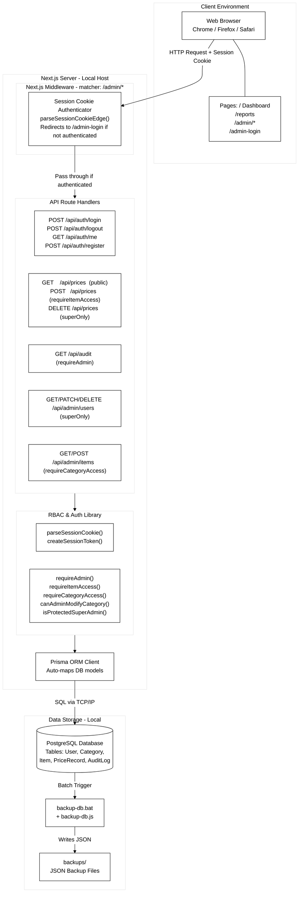

#### Rendered System Architecture Diagram:
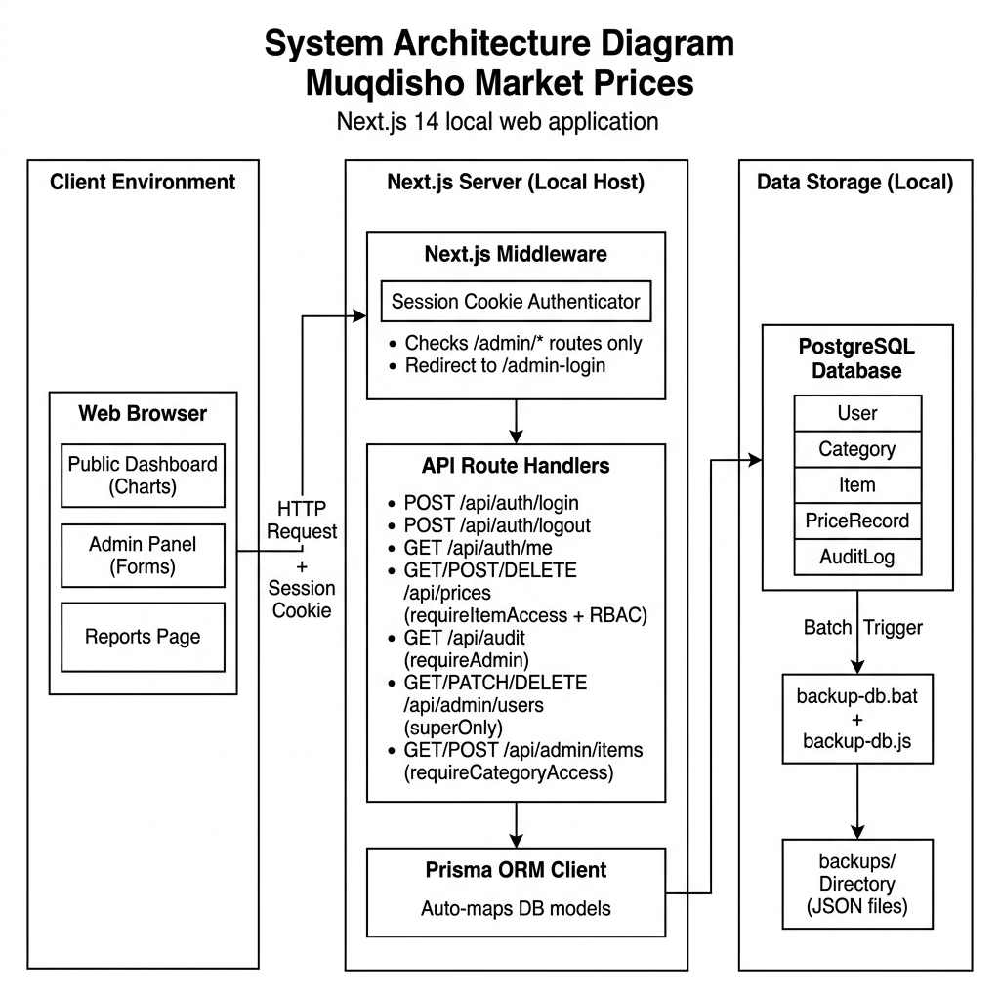

### Astaamaha Muhiimka ah ee Qaabdhismeedka (Key Architectural Traits):
1. **Standalone Isolation:** Nidaamku wuxuu si buuxda ugu shaqeeyaa deegaanka maxalliga ah (local environment) asagoon u baahnayn internet ama daruur (cloud servers) si uu u keydiyo ama u akhriyo xogta.
2. **Role-Based Access Control (RBAC):** Middleware-ka Next.js (`RouteGuard` iyo `RoleGuard`) wuxuu xaqiijiyaa in admin kasta uu beddeli karo oo kaliya qaybta (category) loo xilsaaray.
3. **Automated Portability:** Nidaamku wuxuu leeyahay scripts (`backup-db.bat`) oo si toos ah u dhalinaya JSON backup ah dhammaan xogta isagoo ku kaydinaya meel amni ah oo maxalli ah.
